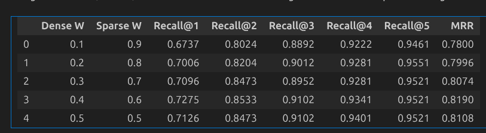

# Building and Evaluating a Multi-Model Research Paper Rag

In this blog I will walk through the production level concepts of the Rag and building the end to end Rag Pipeline, How to Choose right retrival method, chunking method, embeddings model and LLM

## Step 1: Getting the Data

In the Rag, the data is the most important part, The Data is your ground truth if, You should know the source and quality of the data before preparing any solution, that you are using in the understand the quality of the data you are using, the LLM ans you on the taking this data as the context so if the quality of data is not good, the LLM will most likly not give the expected results even after everything going Right

In this project we have taken the data of research papers taken from the arxiv, Now as I said the quality of data is the most important part, SO lets discuss the charactersitc of data

- The Data is in the JSON format
- Image is converyted into the Base64 encoding
- Tabels are seperated 
- The Data is deveided in sections base on the heading
- The text and tables are converted to the markdown format

The problem with the data

- Due to the text is converted to the Markdown format the formulas that are present in the paper is not properly converted so the LLM can never see the formulas 
- The sections are not properly devided, We will encounter this problem in our chunking


## Step 2: The Chunking

- Because the LLM can not get the whole document in its context we use the chunking so that the LLM gets what it needed and dont hallucinates

- Deciding the Chunking method is the first step of the RAG, and It depends highly on data, we need to remember that this data will be given to the LLM so we need to make the Chunking in such a way that the LLM can understand the context

- If the chunking is not rightly done then the chunk that LLM gets will not able to provide LLM the ans that it is looking for and can be misleading

there are many Basic and Advanced methods of chunking and we will be discussing it one by one, And also Which chunking method is right for our project

#### Simple Chunking:
- Spiting text by a certain point

- For e.g If we have choosen 2, Then the Word 'Rock' will be devided in the 'Ro' and 'ck'

- It will not care about the context of the words or any other thinkgs 

- All the Chunks are of equal length

#### RecursiveCharacterSpitter
- It will spit the text based on the certain key points which will be given as such as 
['/n/n', '/n', '.', ' ']

- It any be any chracters but generaly it is the characters given above, It is not guranted that all the chucks will be of equal length but we can give a thresold no chunk will be go beyond that thresold

#### Parent child Chunking 
- In this the chunking is done in the parent chiind format 
- Foe example The Parent will be 10 characters and childs will be 2 characters, then the chunks will be first devided in the 10 characters and then each 10 characters will be devided further into 2 characters, and if any of the chunk ofthis 2 characters will be matched the whole parent chunk will be going to the LLM as context

#### Semantic chunking 
This is the only method where the chunking happend based on the context of te text.

Steps 
- The document is devided into single sentences then it will take a thresold that if the context of this 2 sentences are equal then it will combine the sentences.

- This method sounds good but in practice it doesnt give good results

#### Contextual Chunking (Antropic Version)

It can be done in two ways:

First (less expensive):

- Make a summary of the whole document
- Devide the document in chunks 
- Combine that summary with all the chunks

Second (more expensive):
-  Give the document and chunk to the LLM and ask LLm to give a short text that explains what role this chunk is playing
- Cobine that text generated by the LLM with that chunk

### Conclusion

Every method have its advantages and disadvantages, In production the methods that are mostly used are - 

- Contextual Chunking: Expensive but highly accurate
- Parent-Child Chunking - very less expensive then Contextual Chunking but give pretty good accuracy. disadvantage is increse in retrival time
- Recursive Character splitting - Easiest to implement and works most time in easy task. Retrival and chunking both are fast. But possibility of missing the context.

This is the trade-off between accuracy and speed and cost

In this Project I have taken the Mix of the Recursive Character splitting and the Contexual chunking

As You know in research papper the abstract is the summary of the paper hence we can combine the abastract with every chunk of the paper. which make it similar to the contextual Chiunking

But however adding the abstract to every chunk can make chunks long by repeated characters and make the retrival amgiguos, as all the chunks will be comming from same paper, 

So instead of combining the abstract with every chunk we can give the abstract with the chunk at the query time after the top chunks are selected. This will cut the cost a lot with same level of accuracy

The downside of usng this method is the embeddings will not get the context of the summary with the chunk. so for now It just a Recursive Character Spitter with adding the title of the paper and the section with evert chunk.

If you are making this project at the enterprise level and can bear the cost, contextual chunking gives the highest accuracy.

I have Spitted the text in the 1500 characters with 300 characters overlapping (tested). If the Section is bigger than the 2000 characters otherwise whole section is taken as the simgle chunk.

Overlaping characters decreases the chances of the spitting a topic from between.

The Table is already converted to the taxt so I have sptted the table if it is greter than 2000 characters and I have spitted the table by using the table specific chunking technique.The titleof the table is taken and added with very chunk spitted from that table. 

## Step 3: Embedding 

After chunking 
As we have used the MultiModel Rag, The Embeddings of the Text (Table and text) and Image are done seperately and added to the vectorstore.

Choosing the right embedding model is equally important. However there are lost of open source high accuracy model available on hugging face.

You should check them out by **MTEB leaderboard**

You can see the performance of the embedding models against different tasks and campare the metrics. Choose the model whichh best suits you

We are building the multimodel Rag so we need to take the text embedding model and the image embedding model.
I have used the **"mixedbread-ai/mxbai-embed-large-v1"** model for text mebedings which is of 1024 dim and 200M parameters and **"clip-ViT-B-32** for the image embeddings.

## Step 4: VectorStore

VectorStore is the database but for the vectors.
### Core Capabilities

| Capability | Purpose |
|------------|---------|
| Vector storage | Persist high-dimensional embeddings |
| Similarity search | Find nearest neighbors quickly |
| Metadata filtering | Combine vector search with attribute filters |
| CRUD operations | Update embeddings as data changes |
| Scaling | Handle millions to billions of vectors |

It uses ANN (Approximate Nearest Neighbour) which let us search in the miilions or billions of documnet. ANN has the time compexity of O(log N) and slightly less acurate then the simple linear search. ANN has accuracy of 95 to 99 % and linera serah has the accuracy of 100 %. It decearses the acuracy by 1-5% but increases the speed by a very big margin, It has the time complexity of O(log N) instead of O(N). This is the reason that all the vectorstore is using ANN.

Choices of Vectorstore:

| Database | Type | Best For | Pricing Model |
|----------|------|----------|---------------|
| **Pinecone** | Managed cloud (serverless standard) | Easy start, scale, managed SLAs | Per vector-hour |
| **Qdrant** | Open source / Cloud (Rust, high-perf) | Self-hosted control, fastest open-source on common workloads (~12ms p99 at 10M vectors) | Per GB (cloud) or free |
| **Weaviate** | Open source / Cloud | Native hybrid (BM25 + dense + metadata) in a single query, multimodal | Per dimension-hour |
| **Milvus** | Open source / Cloud (Zilliz) | Distributed scale (50M+ vectors), heterogeneous node types, tiered storage | Free (self-host) or Zilliz Cloud |
| **Chroma** | Open source | Prototyping, local dev, embedded use | Free |

**In our projec** we have used **Qdrant**. Reason - Open sourse, easy self-hosting, fast

SO you can get the Qdrant container from docker registeryy and run it on the any port(default 6333)

And done your Qdrant is now set up.

## Step 5: Retrival (Hybrid Serach)

Now here is the main and the most complex part of the RAG, Retrival is the process of selecting the right chunks from the vectorstore based on the query.  

We can use several methods for this, however there are mainly 2 popular architecture.

### 1. Simple Search
- It take the query encode it into the embedding using same model(imp) and use a semantic similarity for choosing the most releavant chunks. 
- It will get the top-k releant chunks 
- This means it only uses the dence embeddings that we had created. 

### 2. Hyrid Seach
- Hybrid search combines dense (semantic) and sparse (keyword) retrieval to get the benefits of both. It is the baseline for production RAG: Elasticsearch's rrf retriever, OpenSearch hybrid search, Weaviate, Qdrant, and Azure AI Search all ship native hybrid pipelines out of the box.

The hybrid search is the production rag first choice, doe to its advantages,to understand hybrid rag you need to first understand the Dense and Sparse retrival.

#### Dense Retrival:
Uses neural embeddings to match meaning. The embeddings taht is created by mix

**Strengths:**

Understands paraphrases and synonyms
Captures conceptual similarity
Works across languages (with multilingual models)

**Weaknesses:**

May miss exact keyword matches
Struggles with entities, codes, acronyms
Requires embedding model

#### Sparse Retrival

Uses term frequency and statistics (BM25, TF-IDF).

Strengths:

- Excellent for exact matches
- Handles rare terms, codes, entities
- Fast and interpretable
- No training required

Weaknesses:

- Misses semantic similarity
- No synonym understanding
- Sensitive to vocabulary mismatch

The Architecture that we have used in the project 

### Parallel Retrieval with Fusion

```
                    +------------------+
                    |      Query       |
                    +--------+---------+
                             |
              +--------------+--------------+
              v                             v
    +-------------------+         +-------------------+
    |  Dense Retrieval  |         |  Sparse Retrieval |
    |   (Vector DB)     |         |    (BM25/ES)      |
    +---------+---------+         +---------+---------+
              |                             |
              +--------------+--------------+
                             v
                    +-------------------+
                    |      Fusion       |
                    |  (RRF, weighted)  |
                    +---------+---------+
                              |
                              v
                    +-------------------+
                    |  Final Results    |
                    +-------------------+
```

**Pros:** Clear separation, can use best-in-class for each (e.g., Pinecone + Algolia), tune independently
**Cons:** Two separate systems to maintain, higher latency (must wait for the slower engine)

### Fusion Methods

Fusion is the method of combining results from two different search engines.

#### Reciprocal Rank Fusion (RRF)

RRF is the gold standard for combining results from two different search engines. It does not look at the *score* (which is incomparable across engines). It looks at the **rank**.

**Properties:**
- Position-based, ignores raw scores
- Robust to score scale differences -- prevents a single engine from "dominating" just because it has high numerical scores
- k parameter controls rank sensitivity (higher k = less sensitive to position)
- Simple to implement, no tuning beyond k

**Typical k values:** 60 (original paper), 10-100 in practice

### Weighted Score Fusion

- It combine normalized scores

**Properties:**
- Uses actual scores (more information than rank)
- Requires score normalization
- Alpha controls dense vs sparse balance

**In the Project** 
- I have tried both the Wighted Score and the RRF, The results 

- The RRF gives the Values of 0.79

- In weighted Fusion the alpha value should be fine tunned.
- I have tries the alpha value from 0.1 to 0.9, where 0.1 means 10% weight to dense and 90% to sparse
- The 0.4 is giving best output in this project with the value 0.8223 

## Step 6: Reranker

Their are different kings of reranking:
1. By Cross Encoder 
2. By LLM

Any model that can give more accuracy the embedding that is used in the retrival can be used as the Reranker

#### 1.Cross Encoders
The Cross Encoders is poularly used as a reranker. It takes more time and computation and is more accurate as then the Bi-encoders(our embedding model) for getting the similarity between the 2 text.

Cross Encoder Architecture
```
[Query, Document] --> Encoder --> Relevance Score
```
- O(n) per query (process each candidate)
- Sees full query-document context
- Uses the **Attention Mechanism** to compare how specific words in the query change the meaning of words in the document (late interaction)

#### Cross-Encoder reranker Models

| Model | Size | Languages | Quality |
|-------|------|-----------|---------|
| ms-marco-MiniLM-L-6 | 22M | English | Good |
| bge-reranker-base | 278M | English | Very good |
| **bge-reranker-v2-m3** | 568M | Multilingual | Excellent |
| Cohere Rerank v3 | API | Multilingual | Excellent |
| Jina Reranker v2 | Various | Multilingual (8k+ tokens) | Very good |


**The Mistake**: 
- Using the Cross Encoders blindly without evauating the output without Cross Encoders
- The Cross Encoders increases Latency and cost. 
- So it should be only used if you feel the accuaracy improvement is worth it
- Normaly easy task can be give the simalar accuracy with and withit cross encoders

**In Our Project** the I have tested the Accuracy with and without Cross encoder and the resuts are given later into the blog, ultamtely the cross encoders have increased the accuracy of fiding the first relavant chunk. but after second chunk there is not much differece in the accuracy

## Step 7: Evaluation

### Dataset
For testing retrival we need a Golden grounth truth dataset which have the Query and the id of most relevant document

#### How to prepare?:
We can revense the process, by taking the chunk at random and generating the quetion whose ans is given in that chunk using a human or a llm. 

### Recall@k
- It gives the resut of the if the releaavent chunk is in the top k

- For example Recall@3 tells if the releavant documnet is in the top 3 document.

### MRR
- It is the average of how close is the relevant chunk to the first document

### Precision@k
- Out of top k chunks how many are relevant to the quetion 
- One can use a LLm or a human to evaluate.


## The Results

### Using dence Vector Results

- 'Recall@1': np.float64(0.5958),
- 'Recall@2': np.float64(0.7246),
- 'Recall@3': np.float64(0.7904),
-  'Recall@4': np.float64(0.8443),
-  'Recall@5': np.float64(0.8653),
-  'MRR': np.float64(0.6998)

### Hybrid search Results(for Top 10)

Latency = 1 minutes 15 secs // 334 Queries

- 'Recall@1': np.float64(0.7156)
- 'Recall@2': np.float64(0.8263) 
- 'Recall@3': np.float64(0.8922)
- 'Recall@4': np.float64(0.9192) 
- 'Recall@5': np.float64(0.9341) -
- 'MRR': np.float64(0.8085)


### Cross Encoder

Latency = 161 min for 10 chunks retrival per query

- 'Recall@1': np.float64(0.7455),
- 'Recall@2': np.float64(0.8653),
- 'Recall@3': np.float64(0.9012),
- 'Recall@4': np.float64(0.9281),
- 'Recall@5': np.float64(0.9491),
- 'MRR': np.float64(0.8283)


### Colbert
Latency = 1 min overall
- 'Recall@1': np.float64(0.7096),
- 'Recall@2': np.float64(0.8473),
- 'Recall@3': np.float64(0.8862),
- 'Recall@4': np.float64(0.9222),
- 'Recall@5': np.float64(0.9311),
- 'MRR': np.float64(0.8022)

### Observation

- Cross Encoder is only worth It, For Top 1 chunk 
- For 2, 3, 4 and 5 chunks Hybrid Search results are giving enough results.
- Only Dense Retrival should not be used and ColBert is not seems to be very good choice
- If we find a way to getting the Good chunk to go above then the Hybrid search results can be as good as Cross Encoder with low cost and latency


### Using Weighted Fusion:

I have finetuned the alpha value in the between 0.1 to 0.9 and the results are 

🏆 Best Configuration:
Highest MRR (0.819) achieved with Dense Weight = 0.4 and Sparse Weight = 0.6


That means if we are taking the top 3 of the chunks there is the 90 % chance theat we get the chunk that have the ans. 